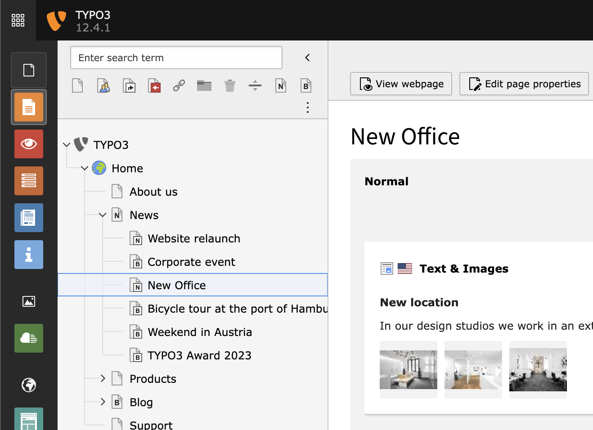

# News

This extension is based on the [TYPO3 pagebased extension](../pagebased/README.md) to create news articles that can be
managed in TYPO3 with all the advantages and functions of "normal" pages



## Features

- List and filter plugin
- Tags
- Categories
- Contacts
- Relations
- Rss feed
- [and more …](https://github.com/zeroseven/pagebased#readme)

## Quick installation

1. Install the extension by `composer req zeroseven/pagebased-news`.
2. Adjust the registration setup in [ext_localconf.php](ext_localconf.php) (if you want that).
3. Create a new page of type "Article-Category" (doktype: 148).
4. All pages inside this category page are automatically treated as article objects.
5. Display article properties on all article pages by using the following TypoScript:

```typo3_typoscript
page.16848430148 = USER
page.16848430148 {
    userFunc = Zeroseven\Pagebased\Utility\RenderUtility->renderUserFunc
    file = EXT:pagebased_news/Resources/Private/Templates/Info.html
    registration = pagebased_news
}
```

## More information

Check out the **[pagebased](../pagebased/README.md)** extension for more information about the configuration and usage
of this extension.
